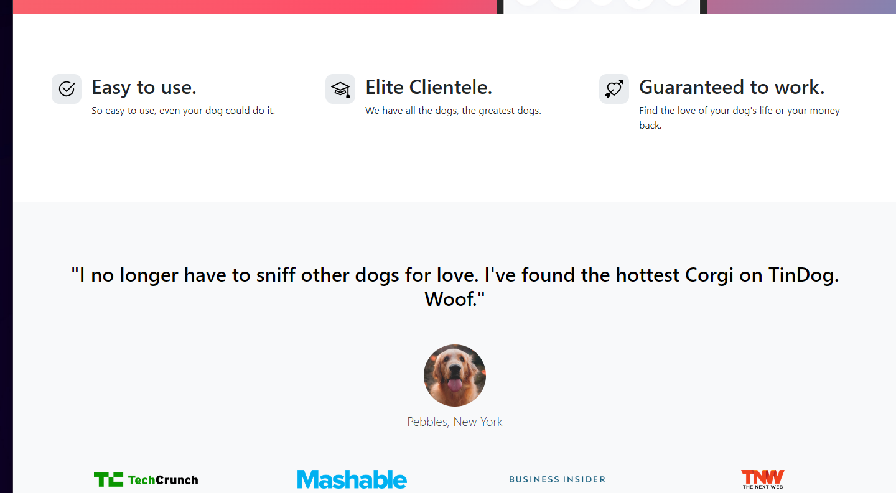

# TinDog - Tinder for Dogs

Tindog is a web application inspired by Tinder, designed specifically for dogs. It allows dog owners to find playdates, mates, or simply socialize their pets. This project is built using HTML, CSS, and Bootstrap for the front-end.

## Features

- **Dog Profiles:** View profiles of different dogs with their images and brief descriptions.
- **Swipe Interaction:** Mimics Tinder's swipe left and right interaction for liking or passing on dog profiles.
- **Responsive Design:** Fully responsive layout using Bootstrap, ensuring a seamless experience across devices.
- **Simple and Intuitive:** Easy to use interface for browsing dog profiles and interacting with them.

## Technologies Used

- **HTML5:** Markup language for structuring the web page.
- **CSS3:** Stylesheet language for styling the HTML elements.
- **Bootstrap 4:** Front-end framework for building responsive and mobile-first websites.

## Getting Started

To run this project locally, follow these steps:

1. Clone this repository: `git clone <repository-url>`
2. Navigate to the project directory.
3. Open `index.html` in your web browser.

## Screenshots

## Contributing

Contributions are welcome! If you find any issues or have suggestions for improvements, feel free to open an issue or create a pull request.

